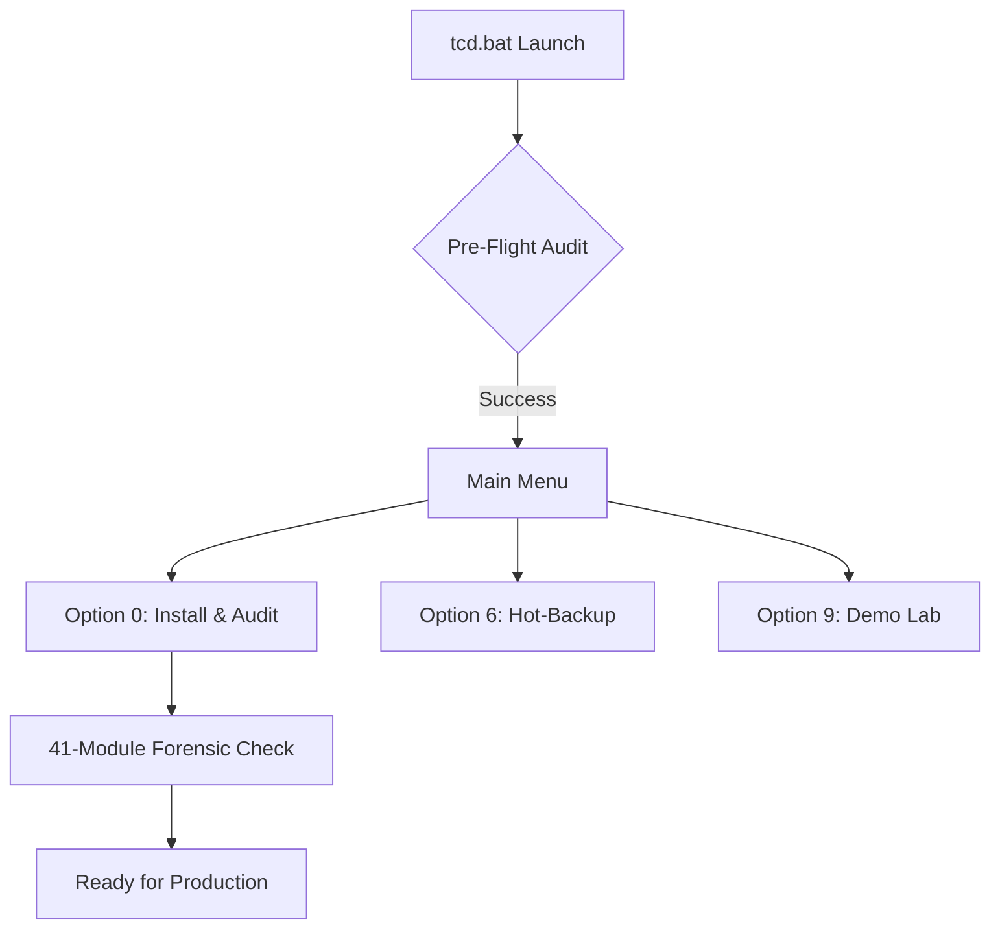

# 🚀 Release v1.1.25 - Stable Launch

### TryDockCmd: The Command-Center for Tryton ERP on Windows

We are proud to announce the first stable release of **TryDockCmd**. This toolkit has been designed from the ground up to eliminate the friction of managing Tryton ERP environments using Docker on Windows systems.

### 🌟 Key Features

* **Unified Menu Interface:** A robust `tcd.bat` controller to manage your entire ERP stack.
* **One-Click "Turnkey" Installation:** Automated deployment including Docker image pulls, database initialization, and localized setup.
* **Forensic Auditing (New):** In-depth verification of 41 ERP modules, XML integrity (Structure vs Data), and PostgreSQL health in seconds.
* **Version-Aware Logic:** Dynamic support for Tryton **7.8.X and 8.X.X**, and future revisions with automated SQL dump injection.
* **Proactive Security:** Integrated hot-backup and disaster recovery modules to keep business data safe without downtime.
* **Smart Log Auditing:** A specialized tool to scan and filter thousands of log lines for critical errors in seconds.
* **I18n Engine:** Full support for English and Spanish, featuring **Elastic Pipe** technology for perfect table alignment.

### 🔧 Installation & Quick Start

1. **Download:** Get the Source Code (Zip or Clone).
2. **Configure:** Set your secure credentials in the `.env` file.
3. **Run:** Execute `tcd.bat` to begin the automated deployment.

### 📦 Release Artifacts

* **`tcd.bat`**: The central brain and Entry Point.
* **`scripts/` Library**: Modular components for Install, Backup, Restore, Logger, and Audit.
* **`lang/` Engine**: Sanitized definition files for global localization.
* **`read-compose.ps1`**: The intelligent bridge for YAML metadata parsing.

### 🎨 Operational Workflow

### 👨‍💻 Behind the Code

---
- __Author:__ [https://www.telepieza.com]
- __Collaborator:__ Gemini (Google AI)
- __Platform:__ Windows (CMD/Batch)
- __Engine:__ Docker & Docker Compose
- __License:__ MIT  
- __Project Status:__ v1.1.25 Stable
---

##### Optimized & Documented with the help of Gemini (Google AI)